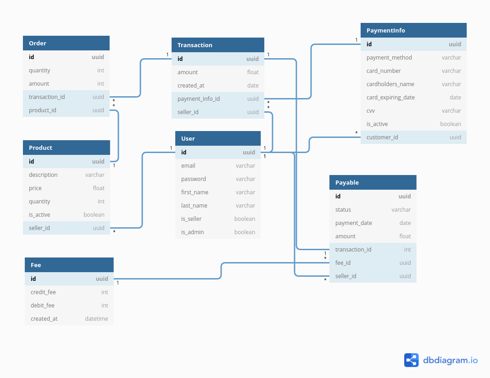

Pagar.me
========

Nesse desafio foi construída uma versão simplificada de um market place e também um sistema de pagamentos, onde é possível comprar produtos e processar transações. 

A atividade foi desenvolvida utilizando a linguagem Python com o framework Django e Django Rest Framework.

* * *
Endpoints
--------

Você pode encontrar a documentação nesse link abaixo com exemplos dos endpoints da aplicação.

[Endpoints](https://pagarme-django.herokuapp.com/api/schema/swagger-ui/)

* * *
Como rodar a aplicação?
--------

1. Crie um arquivo .env na raiz da aplicação seguindo o exemplo contido no arquivo .env.example.
2. Caso tenha o Docker instalado, execute o comando docker compose up ou docker-compose up dependendo da versão do docker-compose que esteja instalada em sua máquina.

* * *
Endpoints e Exemplos
--------

Você pode encontrar a documentação nesse link abaixo com exemplos dos endpoints da aplicação.

[Endpoints](https://pagarme-django.herokuapp.com/api/schema/swagger-ui/)

* * *

Contexto
--------

Esse é apenas um breve resumo sobre o fluxo da aplicação, mais detalhes serão apresentados a seguir.

1.  Será possível cadastrar usuários, que serão divididos em 3 categorias, administradores, vendedores e compradores.
2.  Os usuários poderão fazer o login e receberão um token.
3.  Os vendedores poderão cadastrar produtos em suas contas.
4.  Os compradores poderão criar métodos de pagamento no sistema.
5.  Os compradores poderão comprar os produtos dos vendedores, informar o método de pagamento e isso gerará uma transação (que chamaremos de `transaction`), que por sua vez, formará um recebível (`payable`) para o vendedor.
6.  Os administradores poderão cadastrar taxas no sistema, que representarão o valor que será deduzido dos recebíveis (`payables`) de acordo com o método de pagamento.
7.  Os vendedores poderão visualizar quais os valores já receberam ou que ainda irão receber.
8.  No momento de criação dos recebíveis também deve ser descontado a taxa de processamento (que chamamos de `fee`) do vendedor. Ex: se a taxa for 5% e o comprador processar uma transação de R$100,00, o vendedor só receberá R$95,00. Considere as seguintes taxas padrões:
    *   3% para transações feitas com um cartão de débito
    *   5% para transações feitas com um cartão de crédito
9.  O serviço deve criar os recebíveis do cliente (`payables`), com as seguintes regras:
    *   Se a transação for feita com um cartão de débito:
        *   O payable deve ser criado com status = `paid` (indicando que o cliente já recebeu esse valor)
        *   O payable deve ser criado com a data de pagamento (payment\_date) = data da criação da transação (D+0).
    *   Se a transação for feita com um cartão de crédito:
        *   O payable deve ser criado com status = `waiting_funds` (indicando que o cliente vai receber esse dinheiro no futuro)
        *   O payable deve ser criado com a data de pagamento (payment\_date) = data da criação da transação + 30 dias (D+30).

* * *

Diagrama Entidade/Relacionamento
--------------------------------

* * *
A listagem com as rotas e retornos poderão ser encontradas abaixo:

* * *

Sobre Usuários (`User`):
------------------------

A aplicação terá 3 tipos de usuário:

Administrador - `is_seller=False`, `is_admin=True`

Vendedor - `is_seller=True`, `is_admin=False`

Comprador - `is_seller=False`, `is_admin=False`

### Requisitos:

*   O id é do tipo uuid.
*   O campo de identificação exclusivo do usuário é o e-mail.
*   Somente administradores poderão visualizar a lista de usuários no sistema.
*   A criação dos usuários não tem nenhum tipo de autenticação.
*   O campo de password não é retornado para o usuário.

### Tratamentos de Erros:

*   Caso seja feita a tentativa de algum usuário cujo e-mail já esteja cadastrado no sistema, a resposta deverá ser:
    *   `STATUS 400 - {"email": ["user with this email already exists."]}`

* * *

Sobre Taxas (`Fee`)
-------------------

### Requisitos:

*   O id é do tipo uuid.
*   Deverão existir as seguintes taxas padrões no sistema:
    *   Cartão de crédito - 5%
    *   Cartão de débito - 3%
*   O campo `created_at` é gerado automaticamente com a data e hora do processamento.
*   Somente administradores poderão criar, listar e filtrar taxas no sistema.
*   Não é possível a exclusão de taxas no sistema.

* * *

Sobre Produtos (`Product`)
--------------------------

### Requisitos:

*   O id é do tipo uuid.
*   Os produtos não poderão ter o campo `quantity` com valores menores que 0, ou seja, o saldo mínimo é zero.
*   Somente vendedores poderão cadastrar e atualizar seus próprios produtos.
*   A listagem e a filtragem de produtos é liberada para todos os usuários.
*   Não é possível a exclusão definitiva de produtos, ao invés disso, será feito um `soft delete`, através do campo `is_active`, o vendedor poderá mudar o campo `is_active` através de uma atualização do produto. Logo, não existe uma rota de `DELETE`.
*   É possível fazer uma listagem de produtos por vendedor, e qualquer usuário poderá fazê-la.

### Tratamentos de Erros:

*   Caso algum vendedor tente atualizar um produto que não te pertença, o sistema responderá com:
    *   `STATUS 403 - { "detail": "You do not have permission to perform this action."}`
*   Caso haja a tentativa de listagem de produtos pelo vendedor no endpoint `GET /api/products/seller/<seller_id>/`, e o id não pertencer a nenhum usuário, o sistema deverá responder com:

*   `STATUS 404 - {"detail": "Not found."}`

*   Caso um usuário não autenticado tente acessar algum endpoint que é necessário autenticação, a aplicação responder com:

*   `STATUS 401 - {"detail": "Authentication credentials were not provided."}`

* * *

Sobre Métodos de Pagamento (`PaymentInfo`)
------------------------------------------

### Requisitos:

*   O id é do tipo uuid.
*   Caso a data informada em `card_expiring_date` já tenha passado, o campo `is_active` será setado para `False`.
*   Somente serão retornados para o usuário os últimos 4 dígitos do cartão de crédito.
*   Não será possível o cadastro de cartões de crédito vencidos.
*   Não será possível o cadastro do mesmo cartão para o usuário, exceto, caso o método de pagamento seja diferente, ou seja, 2 cartões iguais porém um é de crédito e o outro é de débito.
*   Somente compradores poderão criar e listar seus próprios métodos de pagamento.
*   Por questões de simplificação, em `card_expiring_date` deverá ser informada a data completa.
*   O campo cvv não será retornado para o usuário.

### Tratamento de Erros

*   Caso haja a tentativa de cadastro de um cartão que esteja vencido, essa deverá ser a resposta:
    *   `STATUS - 400 - { "error": ["This card is expired"]}`
*   Caso o cartão a ser criado já esteja cadastrado para o usuário, a resposta deverá ser:
    *   `STATUS 422 - {"error": ["This card is already registered for this user"]}`

* * *

Sobre Transações e Recebíveis (`Transaction`, `Order` e `Payable`)
------------------------------------------------------------------

### Requisitos:

*   O campo `amount` no model será a soma de todas as ordens que foram realizadas.
*   Todos os produtos deverão pertencer ao mesmo vendedor.
*   Todos os produtos devem existir.
*   A quantidade solicitada de produtos deverá ser maior ou igual a quantidade disponível.
*   O produto deverá estar ativo para que a transação seja realizada.
*   O cartão de crédito informado não poderá estar vencido.
*   Ao final de cada ordem, a quantidade dos produtos deverão ser deduzidas.
*   Deverá ser considerada a última taxa cadastrada no sistema para geração do Payable.
*   Caso o método de pagamento da transação seja `credit` , esses deverão ser os valores dos campos do `Payable`:
    *   `status` = `waiting_funds`
    *   `payment_date` = data da transação + 30 dias
    *   `amount_client` = valor da transação - taxa relativa ao cartão de crédito.
*   Caso o método de pagamento da transação seja `debit` , esses deverão ser os valores dos campos do `Payable`:
    *   `status` = `paid`
    *   `payment_date` = data da transação
    *   `amount_client` = valor da transação - taxa relativa ao cartão de débito.
*   O método de pagamento deverá pertencer ao comprador que estará realizando a transação.
*   Somente compradores poderão processar transações.
*   Vendedores poderão listar suas próprias transações.
*   Somente vendedores poderão listar seus recebíveis (valores a receber e pagos).

### Tratamento de Erros

*   Caso algum produto informado no corpo da requisição não atinja alguns desses requisitos:
    *   O produto deve existir
    *   O produto deve pertencer ao vendedor informado
    *   A quantidade informada deve estar disponível
    *   O produto deve estar ativo
*   A resposta do item acima, deverá ser:
    *   `STATUS 400 - {"error": ["All products must belong to the same seller”, “Product does not exist”, “Product is not available”, “Product is not active"]}`
*   Caso o cartão do método de pagamento informado esteja vencido, a resposta deverá ser:
    *   `STATUS 400 - {"error": ["This card is expired"]}`
*   Caso o método de pagamento informado não pertença ao comprador, essa deverá ser a resposta:
    *   `STATUS 403 - { "detail": "You do not have permission to perform this action."}`

* * *

Tratamento de erros (Gerais)
----------------------------

*   Caso algum usuário tente acessar um endpoint e não tenha as devidas permissões, o sistema deverá responder com:
    *   `STATUS 403 - { "detail": "You do not have permission to perform this action."}`
*   Todos os endpoints que exigirem a utilização de um token de acesso deverão responder da seguinte maneira caso seja informado um token inválido:
    *   `STATUS 401 - {"detail": "Invalid token."}`

* * *

Endpoints
---------

* * *

Resumindo:
----------

URLs:
-----

| Método | Endpoint | Responsabilidade |
|--- |--- |--- |
| POST | /api/accounts/ | Criação de usuários (Não precisa de autenticação) |
| POST | /api/login/ | Faz a autenticação do usuário |
| GET | /api/accounts/ | Listagem de usuários (Somente Admin) |
| POST | /api/fee/ | Criação de uma taxa no sistema (Somente Admin) |
| GET | /api/fee/ | Listagem de taxas no sistema (Somente Admin) |
| GET | /api/fee/{fee_id}/ | Filtragem de taxas no sistema (Somente Admin) |
| POST | /api/products/ | Cadastro de produtos no sistema (Somente vendedor) |
| GET | /api/products/ | Listagem de produtos (Qualquer usuário) |
| GET | /api/products/{products_id}/ | Filtragem de produtos (Qualquer usuário) |
| PATCH | /api/products/{product_id}/ | Atualização parcial de produtos (Somente Vendedor) |
| PUT | /api/products/{product_id}/ | Atualização completa de produtos (Somente Vendedor) |
| GET | /api/products/seller/{seller_id}/ | Filtragem de produtos pelo id do vendedor (Qualquer usuário) |
| POST | /api/{payment_info}/ | Criação do método de pagamento (Somente comprador) |
| GET | /api/{payment_info}/ | Listagem dos métodos de pagamento (Somente comprador) |
| POST | /api/transactions/ | Criação da transação (Somente comprador) |
| GET | /api/transactions/ | Listagem das transações (Somente vendedor) |
| GET | /api/payables/ | Verificar valores a receber (Somente vendedor) |

* * *